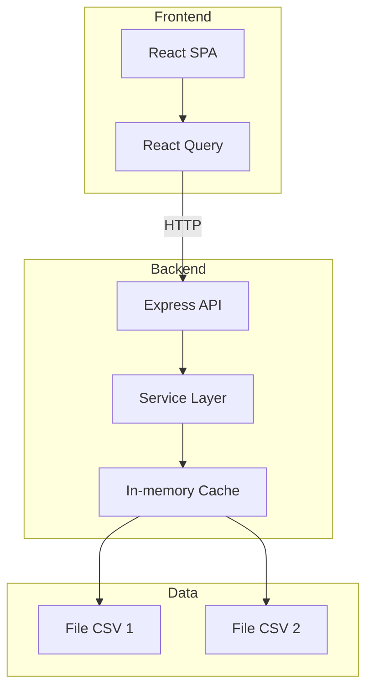

# 🍜 Food Tour SG

Website khám phá các quán ăn/nhà hàng ở Sài Gòn, được xây dựng từ các file excel tổng hợp được chia sẻ trên mạng xã hội Việt Nam.

## Author

**ngsouthbrother04**  
[LinkedIn](https://www.linkedin.com/in/anh-nguyen-496957285/)

## Tech Stack

| Layer | Stack |
|-------|-------|
| Frontend | React 18 + Vite + TypeScript |
| UI | Ant Design 5 + TailwindCSS |
| State | React Query |
| Backend | Express.js + TypeScript |
| Data | CSV (PapaParse) + In-memory cache |

## Architecture



## Quick Start

```bash
# Backend (port 3001)
cd backend && cp .env.example .env && npm i && npm run dev

# Frontend (port 5173)
cd frontend && npm i && npm run dev
```

## API

| Method | Endpoint | Mô tả |
|--------|----------|-------|
| GET | `/api/v1/restaurants` | Search + filter + pagination |
| GET | `/api/v1/restaurants/:id` | Chi tiết quán |
| GET | `/api/v1/restaurants/:id/similar` | Quán tương tự |
| GET | `/api/v1/restaurants/filters` | Danh sách filter options |
| GET | `/api/v1/restaurants/random` | Random 1 quán |
| POST | `/api/v1/admin/reload` | Reload CSV data |

**Query params:** `q`, `district`, `category`, `minPrice`, `maxPrice`, `page`, `limit`, `sort`, `order`

## Data Schema

```typescript
interface Restaurant {
  id: string;
  name: string;
  dish: string;
  category: string;
  address: string;
  district: string;           
  openingHours: string | null;
  priceRange: {
    min: number | null;
    max: number | null;
    display: string;         
  };
  note: string | null;
  review: string | null;
  feedback: string | null;
  source: 'foodtour' | 'saigon_everyfood';
}
```

## Project Structure

```
├── backend/
│   └── src/
│       ├── config/        # Env config
│       ├── controllers/   # Request handlers
│       ├── middlewares/   # Error, validation, logging
│       ├── routes/        # Route definitions
│       ├── services/      # Business logic + CSV loader
│       ├── types/         # TypeScript interfaces + enums
│       └── utils/         # Price parser, district normalizer
├── frontend/
│   └── src/
│       ├── components/    # FilterPanel, RestaurantCard, SearchBar, Map
│       ├── hooks/         # React Query hooks
│       ├── pages/         # HomePage, RestaurantDetailPage
│       ├── services/      # API client
│       └── types/         # Shared types
└── data/                  # CSV files
```

## Features

- Full-text search (tên quán, món, địa chỉ)
- Filter: quận, category, giá
- Pagination + sorting
- Random suggestion ("Hôm nay ăn gì?")
- Restaurant detail + similar suggestions
- Leaflet.js map
- URL state persistence (shareable links)
- Responsive design
- Vietnamese locale

## Security

- `helmet` - HTTP headers
- `express-rate-limit` - 100 req/min
- `zod` - Input validation
- `winston` - Logging

## Testing

```bash
cd backend && npm test
```
