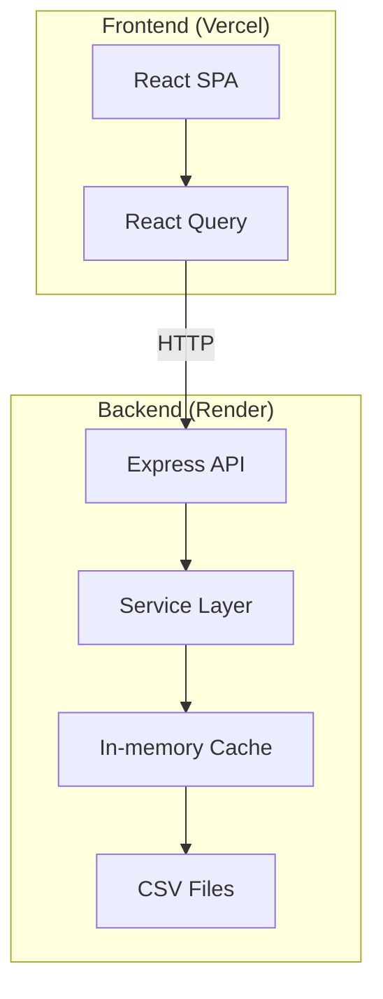

# 🍜 Food Tour SG

Website khám phá các quán ăn/nhà hàng ở Sài Gòn, được xây dựng từ các file excel tổng hợp được chia sẻ trên mạng xã hội Việt Nam.

## 🌐 Live Demo

- **Frontend**: [https://foodtour-sg.vercel.app](https://foodtour-sg.vercel.app)
- **Backend API**: [https://foodtour-sg-api.onrender.com](https://foodtour-sg-api.onrender.com)

> ⚠️ Backend free tier sẽ "sleep" sau 15 phút không có request. Request đầu tiên có thể mất ~30s.

## Author

**[ngsouthbrother04](https://www.linkedin.com/in/anh-nguyen-496957285/)**  

## Tech Stack

| Layer | Stack |
|-------|-------|
| Frontend | React 18 + Vite + TypeScript |
| UI | Ant Design 5 + TailwindCSS |
| State | React Query |
| Maps | Leaflet.js |
| Backend | Express.js + TypeScript |
| Data | CSV (PapaParse) + In-memory cache |
| Deploy | Vercel (FE) + Render (BE) |

## Architecture



## Quick Start (Local Development)

```bash
# Backend (port 3001)
cd backend && npm install && npm run dev

# Frontend (port 5173) - new terminal
cd frontend && npm install && npm run dev
```

Mở http://localhost:5173

## API

| Method | Endpoint | Mô tả |
|--------|----------|-------|
| GET | `/api/v1/restaurants` | Search + filter + pagination |
| GET | `/api/v1/restaurants/:id` | Chi tiết quán |
| GET | `/api/v1/restaurants/:id/similar` | Quán tương tự |
| GET | `/api/v1/restaurants/filters` | Danh sách filter options |
| GET | `/api/v1/restaurants/random` | Random 1 quán |
| GET | `/health` | Health check |

**Query params:** `q`, `district`, `category`, `minPrice`, `maxPrice`, `page`, `limit`, `sort`, `order`

## Project Structure

```
├── backend/
│   ├── data/              # CSV data files
│   └── src/
│       ├── config/        # Env config
│       ├── controllers/   # Request handlers
│       ├── middlewares/   # Error, validation, logging
│       ├── routes/        # Route definitions
│       ├── services/      # Business logic + CSV loader
│       ├── types/         # TypeScript interfaces + enums
│       └── utils/         # Price parser, district normalizer
├── frontend/
│   └── src/
│       ├── components/    # FilterPanel, RestaurantCard, SearchBar, Map
│       ├── hooks/         # React Query hooks, useTheme
│       ├── pages/         # HomePage, RestaurantDetailPage
│       ├── services/      # API client
│       └── types/         # Shared types
```

## Features

- 🔍 Full-text search (tên quán, món, địa chỉ)
- 🏷️ Filter: quận, category, giá
- 📄 Pagination + sorting
- �� Random suggestion ("Hôm nay ăn gì?")
- 📍 Restaurant detail + similar suggestions
- 🗺️ Leaflet.js map integration
- 🔗 URL state persistence (shareable links)
- 🌙 Dark/Light mode toggle
- 📱 Responsive design
- 🇻🇳 Vietnamese locale

## Security

- `helmet` - HTTP headers
- `express-rate-limit` - 100 req/min
- `zod` - Input validation
- `winston` - Logging

## Environment Variables

### Backend
```env
PORT=3001
NODE_ENV=development
CORS_ORIGINS=http://localhost:5173
```

### Frontend
```env
VITE_API_URL=/api/v1
```

## Deployment

### Backend → Render
1. Create Web Service, connect GitHub repo
2. Root Directory: `backend`
3. Build: `npm install && npm run build`
4. Start: `npm start`
5. Add env: `NODE_ENV=production`, `CORS_ORIGINS=https://your-frontend.vercel.app`

### Frontend → Vercel
1. Import GitHub repo
2. Root Directory: `frontend`
3. Add env: `VITE_API_URL=https://your-backend.onrender.com/api/v1`

## Testing

```bash
cd backend && npm test
```

## License

MIT
